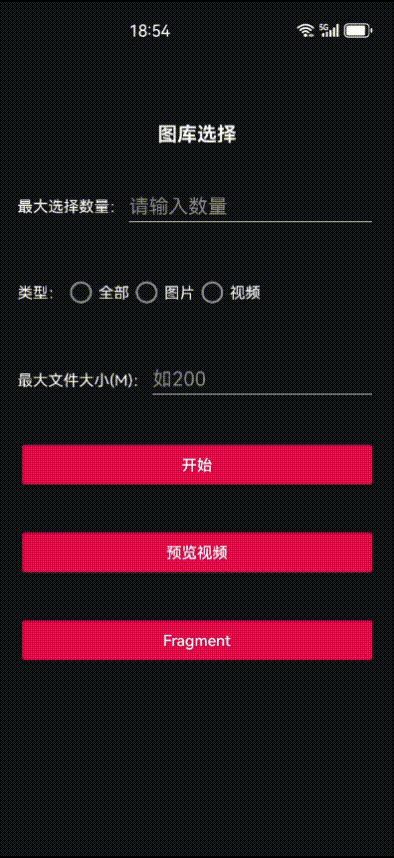

# 图库选择器

### 最新版本 

- 图库选择，
- 仿华为相册滑动选择手势逻辑，
- 微信选择库样式风格
- 支持多选、单选
- 支持拍照、拍视频

### 好不好用，直接安装。
- 扫码：
- 或者：点击下载 [app-debug.apk](app/release/app-debug.apk)

# 依赖库，都是常用库，强烈建议 项目使用。

- 下面的这个三方库，本maven仓库中的aar都过滤掉了。建议自己从下面引用，防止库冲突。

## 最新版本
1. **filepicker** 

2. **xwidget**  
3. **BRV**  
4. **BasePopup** 
5. **androidx.media3** 这里建议使用***1.7.1*** 稳定版  
6. **glide** 

```kotlin
dependencies {
    // 基础组件库 （必须）
    implementation("com.gitee.pichs:filepicker:3.0.0")

    // 基础组件库 （必须）
    implementation("com.gitee.pichs:xwidget:5.5.0")

    // glide 图片加载 （必须）
    implementation("com.github.bumptech.glide:glide:4.16.0")

    //基础库（必须）
    implementation(libs.androidx.core.ktx)
    implementation(libs.androidx.appcompat)
    implementation(libs.androidx.activity.ktx)
    implementation(libs.androidx.fragment.ktx)
    implementation(libs.material)
    implementation(libs.androidx.recyclerview)
    implementation(libs.androidx.annotation)
    implementation(libs.kotlinx.coroutines.android)
    implementation(libs.kotlinx.coroutines.core)

    // brv （必须）
    implementation("com.github.liangjingkanji:BRV:1.6.1")
    // 弹窗 （必须）
    implementation("io.github.razerdp:BasePopup:3.2.1")
    // 视频播放库 （必须）采用exoplayer
    implementation("androidx.media3:media3-exoplayer:1.7.1")
    implementation("androidx.media3:media3-ui:1.7.1")
}
```


# 动图效果



# FilePicker 文件选择器 - 使用文档

`FilePicker` 是一个支持图片、视频、文件选择的轻量级文件选择器，支持自定义配置、选中列表管理、回调返回选中数据。

---

## 快速入口

* **支持 Activity 和 Fragment 调用**
* **支持多选、最大数量控制、文件大小限制**
* **支持返回原图选项**
* **支持 UI 文案与界面定制**

---


## 基本用法

### 1. Activity 中启动

```kotlin
FilePicker.with(this) // this: FragmentActivity
    .setSelectType(FilePicker.ofImage()) // 选择类型，图片、视频、全部
    .setMaxSelectNumber(9) // 最大选择数量
    .setOnSelectCallback { isUseOriginal, list ->
        // 选择完成回调
        println("是否使用原图: $isUseOriginal")
        list.forEach {
            println("文件路径: ${it.path}")
        }
    }
    .start()
```

---

### 2. Fragment 中启动

```kotlin
FilePicker.with(this) // this: Fragment
    .setSelectType(FilePicker.ofAll()) 
    .setMaxSelectNumber(5)
    .setMaxFileSize(50 * 1024 * 1024) // 50MB
    .setMinFileSize(10 * 1024) // 10KB
    .setSelectedList(existingList) // 已选列表（MediaEntity对象）
    .setOnSelectCallback { isUseOriginal, list ->
        println("是否使用原图: $isUseOriginal")
    }
    .start()
```

---

## 选择类型

| 方法                     | 说明        |
| ---------------------- | --------- |
| `FilePicker.ofImage()` | 只选择图片     |
| `FilePicker.ofVideo()` | 只选择视频     |
| `FilePicker.ofAll()`   | 图片、视频均可选择 |

---

## 常用配置参数

| 配置方法                                              | 说明                             | 默认值  |
| ------------------------------------------------- | ------------------------------ | ---- |
| `setSelectType(type: String)`                     | 选择类型：图片、视频、全部                  | 全部   |
| `setMaxSelectNumber(number: Int)`                 | 最大可选数量，0为不限制                   | 0    |
| `setMaxFileSize(size: Long)`                      | 文件最大大小（字节）                     | 不限制  |
| `setMinFileSize(size: Long)`                      | 文件最小大小（字节）                     | 1    |
| `setSelectedList(list: MutableList<MediaEntity>)` | 已选择的文件列表，初始化用                  | 空列表  |
| `setSelectedPathList(list: List<String>)`         | 已选择的文件路径列表，自动转换为 `MediaEntity` | 空列表  |
| `setUiConfig(config: FilePickerUIConfig)`         | 界面文案与UI配置                      | 默认配置 |
| `setOnSelectCallback(callback: OnSelectCallback)` | 选择完成回调                         | 必填   |

---

## 回调说明

```kotlin
fun interface OnSelectCallback {
    fun onCallback(isUseOriginal: Boolean, list: MutableList<MediaEntity>)
}
```

* `isUseOriginal`: 是否选择了“原图”
* `list`: 最终选择的文件列表

---

## 工具方法

| 方法                                                             | 说明                         |
| -------------------------------------------------------------- | -------------------------- |
| `FilePicker.convertToPathList(list: MutableList<MediaEntity>)` | 将选中的 `MediaEntity` 转换为路径列表 |
| `FilePicker.convertToEntityList(list: List<String>)`           | 路径列表转换为 `MediaEntity` 列表   |

---

## UI 文案自定义

通过 `FilePickerUIConfig` 配置界面显示：

```kotlin
val config = FilePickerUIConfig(
    confirmBtnText = "完成",
    previewText = "预览文件",
    isShowOriginal = true,
    originalText = "原图查看",
    atLeastSelectOneToastContent = "请至少选择一项"
)

FilePicker.with(this)
    .setUiConfig(config)
    .setMaxSelectNumber(3)
    .setOnSelectCallback { isUseOriginal, list -> }
    .start()
```

详见 [FilePickerUIConfig 文档](#)

---

## 注意事项

* 必须在 `FragmentActivity` 或 `Fragment` 中调用
* `setOnSelectCallback` 为必填，否则无法接收结果
* 已选列表支持预填充，避免重复选择
* 支持多次调用，内部通过单例模式管理

---

## 典型示例

```kotlin
FilePicker.with(this)
    .setSelectType(FilePicker.ofImage())
    .setMaxSelectNumber(5)
    .setMinFileSize(1024) // 最小1KB
    .setMaxFileSize(10 * 1024 * 1024) // 最大10MB
    .setOnSelectCallback { isUseOriginal, list ->
        val paths = FilePicker.convertToPathList(list)
        println("选中文件路径: $paths")
    }
    .start()
```

---


</br>
### !!!温馨提示： 如果UI效果与你的需求差距较大，强烈建议下载源码，自己修改一下。fork代码，自己改。!!!
</br>
### 三、UIConfig解释

| 字段名                                     | 类型        | 默认值                                  | 说明                                      |
| --------------------------------------- | --------- | ------------------------------------ | --------------------------------------- |
| `confirmBtnText`                        | `String`  | `"确定"`                               | 确认按钮文本，默认 "确定"                          |
| `isShowPreviewPageSelectedIndex`        | `Boolean` | `true`                               | 预览页面是否显示选中索引。`true` 显示序号，`false` 显示对号 ✅ |
| `previewText`                           | `String`  | `"预览"`                               | 预览页面标题文本                                |
| `previewSelectText`                     | `String`  | `"选择"`                               | 预览页面的选择按钮文本                             |
| `originalText`                          | `String`  | `"原图"`                               | 原图选项的文本内容                               |
| `isShowOriginal`                        | `Boolean` | `true`                               | 是否显示原图选项                                |
| `isOriginalChecked`                     | `Boolean` | `false`                              | 原图选项是否默认勾选                              |
| `isShowSelectedListDeleteIcon`          | `Boolean` | `false`                              | 是否展示选中列表中的删除按钮                          |
| `selectedListDeleteIconBackgroundColor` | `Int`     | `XColorHelper.parseColor("#FA4B3A")` | 选中列表中删除按钮的背景颜色                          |
| `atLeastSelectOneToastContent`          | `String`  | `"至少选择一个"`                           | 最少选择一个文件时的提示文本                          |
| `selectMaxNumberOverToastContent`       | `String`  | `"已达到最大选择数量"`                        | 达到最大选择数量限制时的提示文本                        |


## 结束语

`FilePicker` 旨在提供简洁、灵活、可定制的文件选择功能，广泛适用于相册、文件管理、视频选择等场景。

如需深入定制或遇到问题，欢迎补充需求，我可以帮您生成对应的开发指导。
