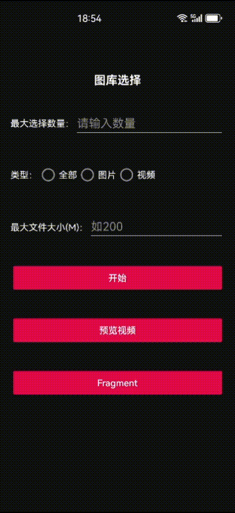

# 图库选择器

### 最新版本 
 - 使用最新版的 filepicker 库，必须使用最新版的xwidget库。都是 5.6.3 以上确保。
- 用了很多，都没有丝滑的选择效果的开源库，滑动选择丝滑。闲来没事，随手写一个吧。
- 图库选择，文件选择
- 仿华为相册滑动选择手势逻辑，
- 微信选择库样式风格
- 支持多选，限制数量，不限制数量。
- 使用场景，多用于 视频剪辑选择库，相册管理选择库。那去玩吧。

### 好不好用，直接安装。

- 扫码：
- 或者：点击下载 [app-debug.apk](app/release/app-debug.apk)

# 依赖库，都是常用库，强烈建议 项目使用。

- 下面的这个三方库，本maven仓库中的aar都过滤掉了。建议自己从下面引用，防止库冲突。

## 最新版本

1. **filepicker
   ** 
2. **[xwidget](https://github.com/pichsy/xwidget)
   **  
3. **BRV
   **  
4. **BasePopup
   ** 
5. **androidx.media3** 这里建议使用***1.7.1***
   稳定版 
6. **glide** 

```kotlin
dependencies {
    // 基础组件库 （必须）
    implementation("com.gitee.pichs:filepicker:5.8.0")

    // 基础组件库 （必须）
    implementation("com.gitee.pichs:xwidget:5.6.3")

    // glide 图片加载 （必须）
    implementation("com.github.bumptech.glide:glide:4.16.0")

    //基础库（必须）
    implementation(libs.androidx.core.ktx)
    implementation(libs.androidx.appcompat)
    implementation(libs.androidx.activity.ktx)
    implementation(libs.androidx.fragment.ktx)
    implementation(libs.material)
    implementation(libs.androidx.recyclerview)
    implementation(libs.androidx.annotation)
    implementation(libs.kotlinx.coroutines.android)
    implementation(libs.kotlinx.coroutines.core)

    // brv （必须）
    implementation("com.github.liangjingkanji:BRV:1.6.1")
    // 弹窗 （必须）
    implementation("io.github.razerdp:BasePopup:3.2.1")
    // 视频播放库 （必须）采用exoplayer
    implementation("androidx.media3:media3-exoplayer:1.7.1")
    implementation("androidx.media3:media3-ui:1.7.1")
}
```

# 动图效果



# FilePicker 文件选择器 - 使用文档

`FilePicker` 是一个支持图片、视频、文件选择的轻量级文件选择器，支持自定义配置、选中列表管理、回调返回选中数据。

---

## 快速入口

* **支持 Activity 和 Fragment 调用**
* **支持多选、最大数量控制、文件大小限制**
* **支持返回原图选项**
* **支持 UI 文案与界面定制**
* **支持滑动选择**
* **支持单选立即返回**
* **支持预选列表**

---

## 基本用法

### 1. 在 Activity 中启动

```kotlin
FilePicker.with(this) // this: FragmentActivity
    .setSelectType(FilePicker.ofImage()) // 设置选择类型
    .setMaxSelectNumber(9) // 设置最大选择数量
    .setSlideChooseEnable(true) // 开启滑动选择
    .setOnSelectCallback(object : OnSelectCallback {
        override fun onSelectedCallback(isUseOriginal: Boolean, list: MutableList<MediaEntity>) {
            // 选择完成回调
            println("是否使用原图: $isUseOriginal")
            list.forEach {
                println("文件路径: ${it.path}")
            }
        }
        override fun onCancel() {
            // 取消选择
        }
    })
   .setUiConfig(
      FilePickerUIConfig(
         isHideSelectTab = false,
         allAlbumName = "全部",
         confirmBtnText = "发送",
         isShowOriginal = false,
         isPreviewPageIndexMode = true,
         isShowSelectedListDeleteIcon = true,
         folderNickNameMap = hashMapOf(
            "DCIM" to "相册"
         )
      )
   ).
    .start()
```

### 2. 在 Fragment 中启动

```kotlin
FilePicker.with(this) // this: Fragment
    .setSelectType(FilePicker.ofImage())
    .setMaxSelectNumber(5)
    .setMaxFileSize(50 * 1024 * 1024) // 50MB
    .setMinFileSize(1 * 1024) // 1KB
    .setOnSelectCallback { isUseOriginal, list ->
        // 选择完成回调
    }
   .setUiConfig(
      FilePickerUIConfig(
         isHideSelectTab = true,
         allAlbumName = "全部",
         confirmBtnText = "下一步",
         isShowOriginal = false,
         isPreviewPageIndexMode = true,
         isShowSelectedListDeleteIcon = true,
         folderNickNameMap = hashMapOf(
            "DICM" to "相机",
            "Download" to "下载"
         )
      )
   ).
    .start()
```

---

## API 文档

### FilePicker

| 方法名 | 描述 |
| --- | --- |
| `with(activity)` | 使用 `FragmentActivity` 初始化 |
| `with(fragment)` | 使用 `Fragment` 初始化 |
| `ofImage()` | 只选择图片 |
| `ofVideo()` | 只选择视频 |
| `ofAll()` | 选择图片和视频 |
| `ofAllWithGif()` | 选择图片、视频和GIF |
| `ofGif()` | 只选择GIF |
| `ofAudio()` | 只选择音频 |
| `ofDocument()` | 选择所有文档类型 |
| `ofPdf()` | 只选择PDF |
| `ofDoc()` | 只选择DOC和DOCX |
| `ofPpt()` | 只选择PPT和PPTX |
| `ofExcel()` | 只选择XLS和XLSX |
| `ofTxt()` | 只选择TXT |
| `ofApk()` | 只选择APK |
| `ofZipAll()` | 选择所有压缩包类型 |
| `ofZip()` | 只选择ZIP |
| `ofRar()` | 只选择RAR |
| `of7Z()` | 只选择7Z |
| `ofTar()` | 只选择TAR |
| `ofGz()` | 只选择GZ |
| `ofBz2()` | 只选择BZ2 |
| `ofIso()` | 只选择ISO |
| `convertToPathList(list)` | 将 `MediaEntity` 列表转换为路径列表 |
| `convertToEntityList(list)` | 将路径列表转换为 `MediaEntity` 列表 |

### Builder

| 方法名 | 描述 |
| --- | --- |
| `setSelectType(type)` | 设置选择的文件类型 |
| `setMaxSelectNumber(num)` | 设置最大选择数量 |
| `setMaxFileSize(size)` | 设置最大文件大小（字节） |
| `setMinFileSize(size)` | 设置最小文件大小（字节） |
| `setSlideChooseEnable(enable)` | 是否启用滑动选择，默认 `true` |
| `setSingleClickEnable(enable)` | 是否启用单选立即返回，默认 `false`。仅在 `maxSelectNumber` 为1时生效 |
| `setSelectedList(list)` | 设置已选中的 `MediaEntity` 列表 |
| `setSelectedPathList(list)` | 设置已选中的文件路径列表 |
| `setUiConfig(config)` | 设置自定义UI配置 |
| `setOnSelectCallback(callback)` | 设置选择结果回调 |
| `start()` | 启动选择器 |

### UI 自定义配置 (FilePickerUIConfig)

通过 `FilePicker.with(this).setUiConfig(uiConfig)` 进行设置。

```kotlin
val uiConfig = FilePickerUIConfig().apply {
    isHideSelectTab = false
    confirmBtnText = "完成"
    allAlbumName = "所有文件"
    // ... 更多配置
}
```

| 属性 | 类型 | 描述 | 默认值 |
| --- | --- | --- | --- |
| `isHideSelectTab` | `Boolean` | 是否隐藏顶部分类Tab | `false` |
| `confirmBtnText` | `String` | 确定按钮的文本 | `"确定"` |
| `isPreviewPageIndexMode` | `Boolean` | 预览页面是否显示页码 | `true` |
| `allAlbumName` | `String` | “全部”文件夹的显示名称 | `"全部"` |
| `previewText` | `String` | 预览页面的标题 | `"预览"` |
| `isShowBottomPreviewText` | `Boolean` | 是否显示底部预览按钮 | `true` |
| `previewSelectText` | `String` | 预览页面底部“选择”按钮文本 | `"选择"` |
| `originalText` | `String` | “原图”选项的文本 | `"原图"` |
| `isShowOriginal` | `Boolean` | 是否显示“原图”选项 | `true` |
| `isOriginalChecked` | `Boolean` | “原图”选项是否默认选中 | `false` |
| `isShowHomePageSelectedBottomListWidget` | `Boolean` | 是否显示主页底部已选列表 | `true` |
| `isShowSelectedListDeleteIcon` | `Boolean` | 是否显示已选列表项的删除按钮 | `false` |
| `selectedListDeleteIconResId` | `Int` | 已选列表项删除按钮的图标资源ID | `0` |
| `selectedListDeleteIconBackgroundColor` | `Int` | 已选列表项删除按钮的背景色 | `Color.TRANSPARENT` |
| `atLeastSelectOneToastContent` | `String` | 未选择任何文件时的提示 | `"至少选择一个"` |
| `selectMaxNumberOverToastContent` | `String` | 超出最大选择数量时的提示 | `"已达到最大选择数量"` |
| `folderNickNameMap` | `HashMap<String, String>` | 文件夹名称映射，用于自定义显示名称 | `emptyHashMap()` |

---

</br>
## !!!温馨提示： 如果UI效果与你的需求差距较大，强烈建议下载源码，自己修改一下。fork代码，自己改。!!!
</br>

---

## 结束语

`FilePicker` 旨在提供简洁、灵活、可定制的文件选择功能，广泛适用于相册、文件管理、视频选择等场景。

如需深入定制或遇到问题，欢迎补充需求，我可以帮您生成对应的开发指导。

## 特别鸣谢

本项目在开发过程中参考和使用了以下优秀的开源项目，特此致谢：

- [xwidget](https://github.com/pichsy/xwidget) - 提供了超级方便的基础组件。
- [BRV](https://github.com/liangjingkanji/BRV) —— 便捷的 RecyclerView 适配器库
- [BasePopup](https://github.com/razerdp/BasePopup) —— 强大的弹窗库
- [Glide](https://github.com/bumptech/glide) —— 高效的图片加载库
- [androidx.media3](https://developer.android.com/jetpack/androidx/releases/media3) —— 官方视频播放组件

感谢你们的无私奉献，让开发变得更加高效和有趣！

## 升级日志
### 5.8.0 stable版本
- 修复最后一行选中图片被遮挡的问题
- 优化放大图标，更好看了。

### 5.7.0
- 优化过多图片首屏展示慢的问题。

### 5.6.3 
- 修复音频播放放到后台还在继续的问题。

### 5.6.2
- 适配xwidget的工具类，适配底部导航栏。xwidget库务必使用最新 5.6.2 版本。
- 为了让版本 跟[xwidget](https://github.com/pichsy/xwidget)关联，方便使用和记忆，版本号跟[xwidget](https://github.com/pichsy/xwidget)统一了。

### 4.6.1

- 剔除日志影响

### 4.6.0

- 新版UI 点击更丝滑


### 4.5.1

- 适配底部小横导航栏
- 优化UI选择样式

### 4.3.0 (预计)

- **新增**：支持更多文件类型选择，如文档（audio, pdf, doc, ppt, excel, txt）、APK、各类压缩包等。
- **新增**：`setSingleClickEnable(boolean)` API，支持单选模式下单击立即返回。
- **新增**：`setSlideChooseEnable(boolean)` API，可禁用滑动选择手势。
- **新增**：`FilePickerUIConfig` 中增加 `isHideSelectTab`、`allAlbumName`、`isShowBottomPreviewText` 等UI配置项。

### 4.2.0

- 修复maxFileSize默认值:目前改为Long.MAX_VALUE .

### 4.1.0

- 适配手机底部导航栏，为屏幕内虚拟三键的情况。
